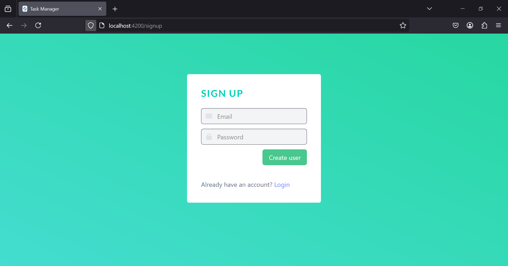
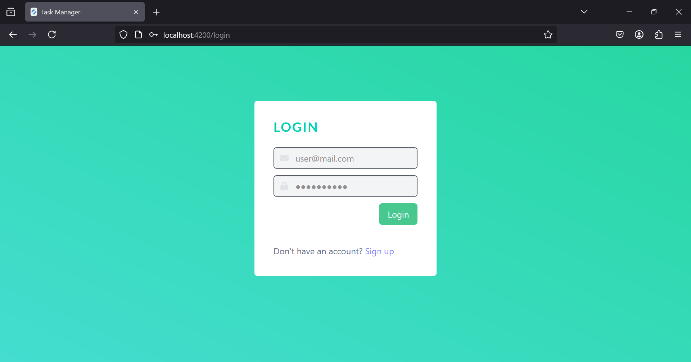
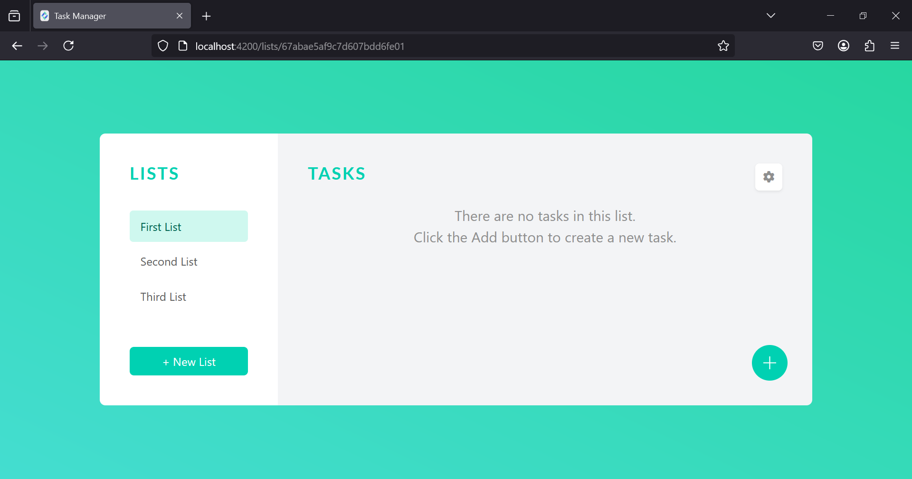
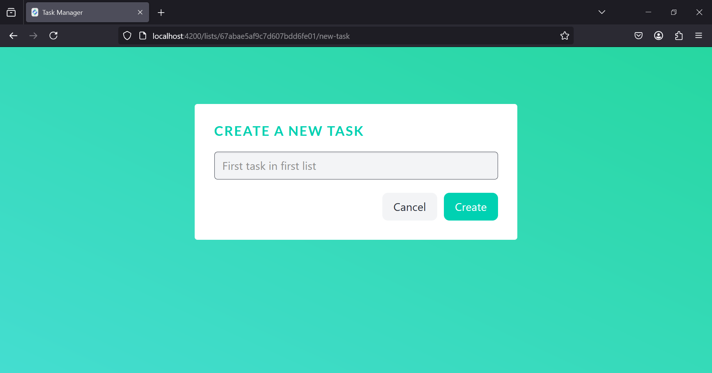
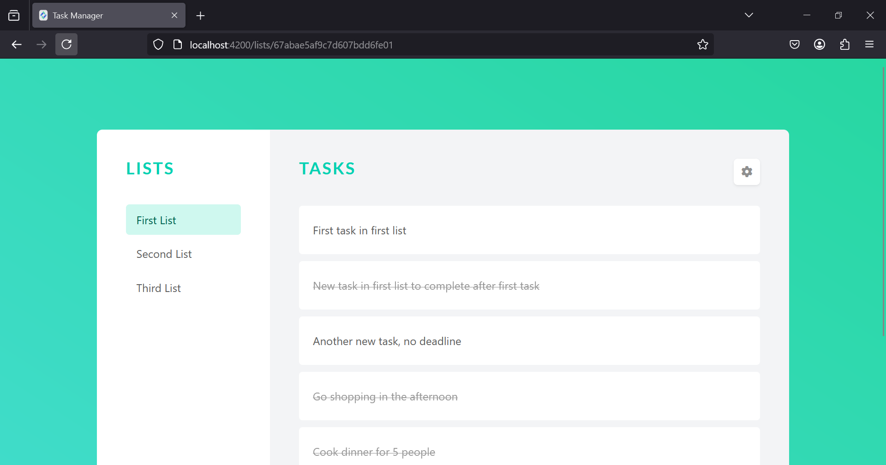
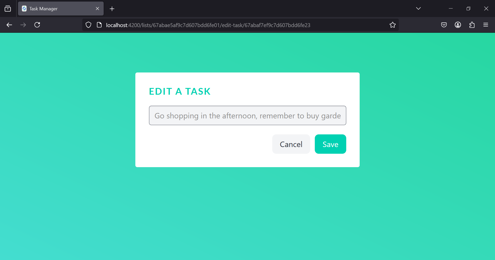
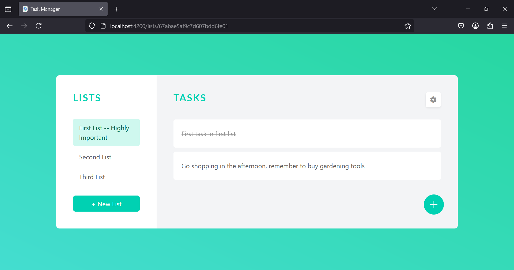
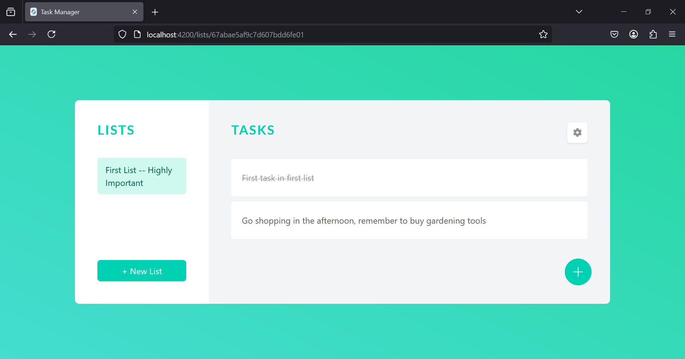

# Task Manager

A task manager application created using the MEAN stack:
 - Node.js
 - Angular
 - Express
 - MongoDB

### Prerequisites
Download and install [Node.js](https://nodejs.org/en/download) runtime, [Angular](https://angular.dev/installation) framework and [MongoDB](https://www.mongodb.com/docs/manual/tutorial/install-mongodb-on-windows/) database.

## Run project

1. Go inside _api_ folder and _frontend_ folder and install all dependencies from `package.json` using `npm install` or `yarn install`.
```console
task-manager> cd ./api
task-manager\api> npm install
task-manager\api> cd ..
task-manager> cd ./frontend
task-manager\frontend> npm install
```
2. Run the server from _api_ folder using `nodemon`:
```console
task-manager> cd ./api
task-manager\api> nodemon app.js
```
3. Run the frontend from _frontend_ folder using `ng`:
```console
task-manager> cd ./frontend
task-manager\frontend> ng serve
```

## Presentation

| Sign up                                           | Login                                           | 
|---------------------------------------------------|-------------------------------------------------|
|  |  |

| Dashboard with 3 empty lists                                      | Create a new task                                           | 
|-------------------------------------------------------------------|-------------------------------------------------------------|
|  |  |

| New task successfully created                                             | Created 6 new tasks in list                                   | 
|---------------------------------------------------------------------------|---------------------------------------------------------------|
|  |  |

| Delete 4 tasks in list                                        | Edit task                                                     | 
|---------------------------------------------------------------|---------------------------------------------------------------|
|  |  |

| Task successfully edited                                                          | Edit list                                              | 
|-----------------------------------------------------------------------------------|--------------------------------------------------------|
|  |  |

| List successfully edited                                                   | Delete 2 lists                                                                 | 
|----------------------------------------------------------------------------|--------------------------------------------------------------------------------|
|  |  |

